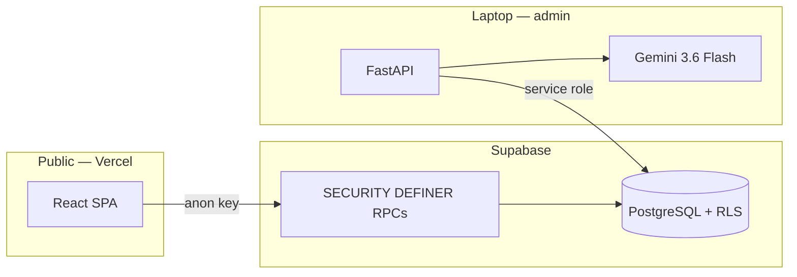
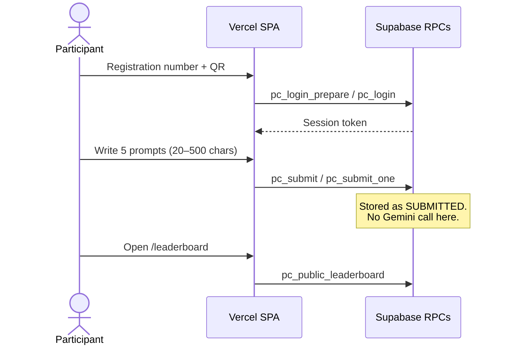
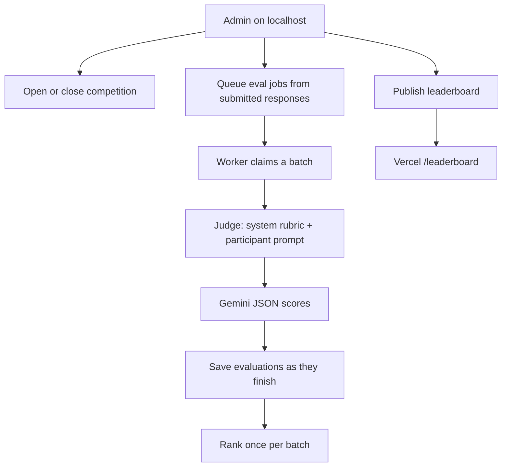
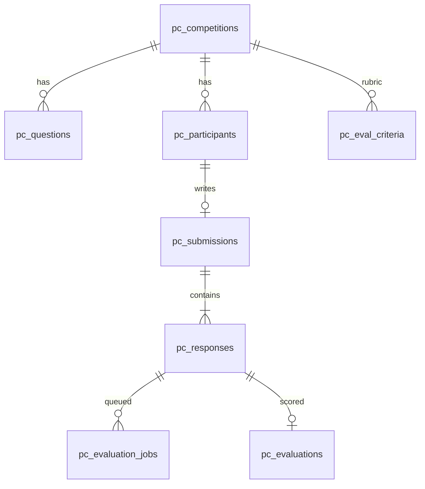

# Master Prompters 2.0

A prompt-writing competition platform. Participants sign in with their event
registration number, confirm with the event QR code, write **five category
prompts**, and submit once. Scoring is Gemini evaluation started later from a
local admin app on a laptop. The public site never waits on the model.

Live competition id: `competition_2026`. Isolated eval sandbox: `competition_test`.

## What participants write

One prompt per category. **Each prompt must be 20–500 characters** (leading and
trailing spaces ignored). The write form, review/submit screen, FastAPI
validators, and Supabase submit RPCs all enforce that window.

| # | Category | What to write |
|---|---|---|
| 1 | Meme Generation | An original, shareable meme: joke, visual setup, on-screen text, tone, audience. Readable on a phone. |
| 2 | AI Visual Art Creation | A finished artwork brief: subject, composition, lighting, palette, medium, mood. |
| 3 | AI Digital Storytelling / Creative Writing | A story or scene: character, setting, conflict, voice, ending, genre, length. |
| 4 | AI Song Factory | An original song: genre, mood/tempo, structure, vocal character, the feeling it should leave. |
| 5 | AI-Generated Poetry in Local Languages | A poem in a named Indian or regional language: form, imagery, meaning. |

## How it is deployed

Two surfaces share one Postgres database. They do **not** share secrets.



- **Participants** — React SPA on **Vercel**. Login, drafts, submit, and the
  public leaderboard talk **directly to Supabase** with the anon key. FastAPI
  is not on this path.
- **Admin + Gemini eval** — FastAPI on **your laptop**, using the service-role
  key. Open/close the competition, run evaluation (hours is normal), publish
  results. After publish, participants reload `/leaderboard` on Vercel.

Never put `SUPABASE_SERVICE_ROLE_KEY` or `GEMINI_API_KEY` in the frontend or on
Vercel.

## Participant path



1. Enter the event registration number, then scan or paste the QR (`GENAI_QR_...`).
2. The QR is matched against the existing `registrations` table (read-only).
3. Write all five categories. Drafts stay in the browser until submit.
4. Review lists the 20–500 character rule and each category description.
5. Confirm once. Evaluation starts only when an administrator runs it.

A pipeline tester account can sign in with registration number only and is
excluded from leaderboards.

## Admin and evaluation path



- Judge model: `gemini-3.6-flash` with `thinking_level=minimal` and a small
  output cap. Rubric lives in `system_instruction`; the user turn is only the
  participant prompt.
- Do not batch multiple participant prompts in one Gemini call — mixed scores.
- Pause, resume, and retry failed jobs from the admin eval screen.
- Cost is estimated from `pc_evaluation_cost_lookup` using reported token usage.

## Data model (new tables only)

Existing `events`, `registrations`, and `checkins` are **not** modified. New
`pc_*` tables are additive.



| Table | Role |
|---|---|
| `pc_competitions` | Live (`competition_2026`) and TEST (`competition_test`) |
| `pc_questions` | Five categories; `min_length=20`, `max_length=500` |
| `pc_participants` | Mapped from QR registrations |
| `pc_submissions` | One per participant |
| `pc_responses` | Five prompts per submission |
| `pc_evaluation_jobs` | Internal Gemini job queue |
| `pc_evaluations` | Scores and criteria breakdown |
| `pc_eval_criteria` | Versioned markdown rubrics |
| `pc_evaluation_cost_lookup` | Deterministic Gemini unit prices |

## Stack

- **Frontend** — React + TypeScript + Vite, Tailwind CSS, shadcn/ui + Radix, Motion
- **Backend** — Python + FastAPI + Pydantic (admin + evaluator, local)
- **Database** — Supabase PostgreSQL
- **LLM** — Google Gemini (evaluator; laptop only)

## Repo layout

```
frontend/          React + Vite SPA
backend/           FastAPI admin + evaluator
supabase/
  migrations/      0000_full_setup.sql plus additive 0001…0009
scripts/
  apply_db.py      optional direct DB apply (needs DATABASE_URL)
  populate_test_dataset.py   seed TEST competition
  e2e_production_test.py
docs/
  SETUP.md         step-by-step setup and env vars
```

## Quick start

See [docs/SETUP.md](docs/SETUP.md). Paste **`supabase/migrations/`** in order
(`0000` … `0009`) into the Supabase SQL editor. Existing event tables are
untouched. `0005` + `0007` are required before the Vercel participant site can
log in or submit. `0009` is required for the 20–500 character limits on an
already-seeded project.

```bash
# backend
cd backend
pip install -r requirements.txt
uvicorn app.main:app --reload --host 127.0.0.1 --port 8000

# frontend (new terminal)
cd frontend
npm install
npm run dev
```

Admin UI: `http://localhost:5173/admin` (local FastAPI). Participant UI can be
local or the Vercel deployment.

## Security

- `SUPABASE_SERVICE_ROLE_KEY` and `GEMINI_API_KEY` are laptop/backend only.
- RLS on all new tables. The Vercel app only has the anon key and SECURITY
  DEFINER RPCs (`pc_login_*`, `pc_submit*`, `pc_public_leaderboard`).
- Admin is a separate username/password login (bcrypt-verified, rate-limited)
  that mints a `role=admin` JWT. Use `/admin` on localhost with a Live / Test
  mode switch.

## Testing

```bash
cd backend && .venv/Scripts/python.exe -m pytest -q
cd frontend && npm run lint && npm run typecheck

# optional end-to-end checks against a running server (does not wipe the
# TEST dataset unless you pass --wipe-test-data):
cd backend && .venv/Scripts/python.exe ../scripts/e2e_production_test.py --mode admin
```

Populate the isolated TEST competition from CLI only (prompts are fitted to
20–500 characters):

```bash
python scripts/populate_test_dataset.py --total 300
```

Admin → Test mode runs the same Gemini evaluation path as live. There is no
dummy evaluator and no seed/cleanup UI.
